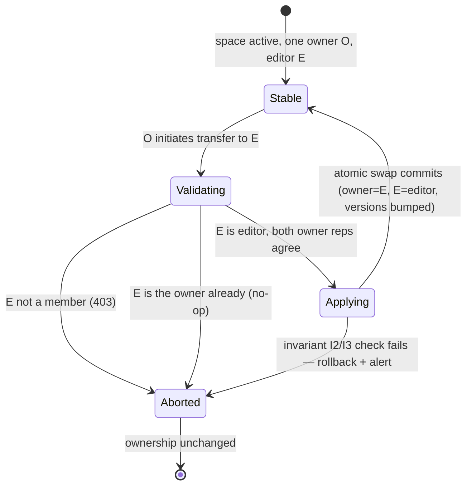
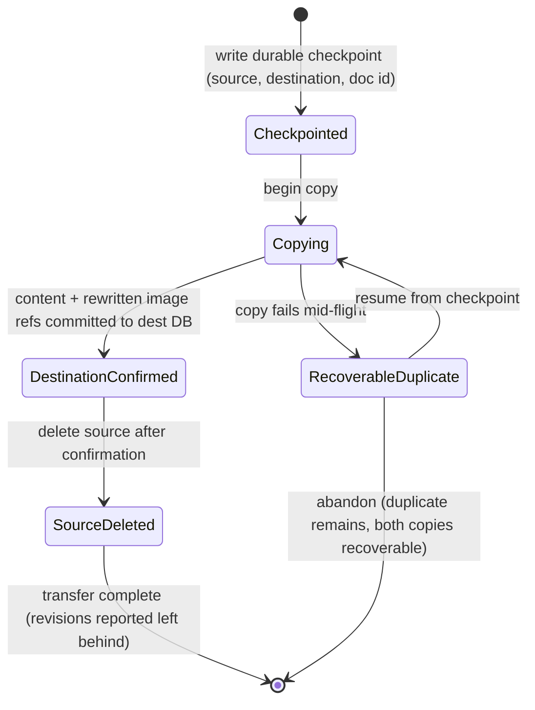

# COLLAB-04 Phase 0 — Design Artifacts

> Authorization matrix, `_spaces.db` invariants, transfer state, migration/compatibility,
> and backup/restore contracts. These five artifacts gate COLLAB-04 Phases 2–6.
> Status: approved
> Created: 2026-08-17
> Last updated: 2026-08-17
> Part of [COLLAB-04](collab-04-shared-spaces.md) · Gate 6 of [COLLAB-00](collab-00-overview.md)

---

## 0) Purpose and approval checklist

Phase 1 landed as a pure refactor behind `SHARED_SPACES_ENABLED=false`: canonical database
keys (`user:<uuid>` / `space:<uuid>`), a versioned content initializer, `_spaces.db`, and an
internal owner/editor membership repository with no public routes. Before any externally
visible phase (Phase 2 onward) may start, the following contracts must be approved. Each is a
separate section below.

- [x] **A. Authorization matrix** (§1) — every space operation, its role, and its failure mode.
- [x] **B. `_spaces.db` invariants** (§2) — every integrity condition, its enforcement point,
      and the automated checker plus alert that verifies it.
- [x] **C. Transfer state diagrams** (§3) — ownership transfer and cross-database content
      transfer, with failure and recovery states.
- [x] **D. Migration/compatibility matrix** (§4) — every client/server/schema/flag combination
      and its fail-closed behavior.
- [x] **E. Atomic backup/restore procedure** (§5) — the consistency contract and the gap in the
      current backup path that must be closed before spaces are admitted.

**Code grounding.** The statements below are checked against the landed Phase 1 code —
`backend/api-service/db.js` (canonical keys, `initializeContentDb`, `initializeSpacesDb`,
`getSpacesDb`, `listUserDbIds`), `backend/api-service/spaces.js` (owner/editor repository),
`backend/api-service/sync.js` (current `/sync`), `backend/api-service/backup.js` (GitHub
content backup), `scripts/production-database-backup/stream-database-backup.mjs` and
`.sh` (SQLite online backup), and `docker-compose*.yml` (volumes). Where an artifact describes
behavior that is not yet implemented, it is marked **specified, not yet implemented** with the
phase that owns it.

---

## 1) Authorization matrix

### 1.1 Roles

v1 has exactly two roles (COLLAB-00 §4): **owner** and **editor**. A "viewer" role is rejected
by the API rather than silently accepted. There is no per-document permission; the space is the
authorization unit. There is no nested or shared-into-shared space (COLLAB-04 §2).

Every route authorizes from `req.user.user_id` set by `authenticateToken`; nothing trusts a
body-, query-, or client-supplied user id. The landed `spaces.js` already centralizes this for
membership operations (`requireUser`, `requireOwner`). The same discipline must extend to every
space-scoped route added in later phases.

### 1.2 Failure-mode conventions

| Outcome | Meaning | When |
|---|---|---|
| `allowed` | Operation proceeds | Role holds |
| `404` | Space existence is not disclosed | Authenticated **non-member** on any space-scoped route |
| `403` | Caller is a member but lacks the role | Editor attempts an owner-only operation |
| `409` | Request conflicts with space state | Invite expired/reused, owner leaves without transfer, removal of owner |
| `401` | No valid JWT | Unauthenticated |
| `426` | Client below the schema floor | `minimum_client_schema` exceeded (Phase 2+) |

Non-membership returns `404`, never `403`, so a probing caller cannot distinguish "no such
space" from "you are not in it" (COLLAB-04 §8). Owner-only operations are enforced server-side,
never only hidden in the UI (COLLAB-04 §8).

### 1.3 Matrix

Legend: **O** owner, **E** editor, **N** authenticated non-member, **A** anonymous.

| # | Operation | O | E | N | A | Enforcement point / notes |
|---|---|---|---|---|---|---|
| 1 | Create space | allowed | allowed | allowed | 401 | Any authenticated user may create; creator becomes sole owner. `spaces.js:createSpace` |
| 2 | List my spaces | allowed | allowed | allowed | 401 | Returns only the caller's memberships; `listSpacesForUser` filters `status = 'active'` |
| 3 | Read space profile / membership | allowed | allowed | 404 | 401 | Member-scoped read |
| 4 | Rename space | allowed | 403 | 404 | 401 | Owner-only; §3.4 |
| 5 | Invite editor by email | allowed | 403 | 404 | 401 | Owner-only; invites create editors only |
| 6 | Accept invite | — | allowed | 403→redeem | 401 | Redeem only by account matching normalized invite email; token hashed, expiring, single-use |
| 7 | Revoke invite | allowed | 403 | 404 | 401 | Owner-only |
| 8 | Resend invite | allowed | 403 | 404 | 401 | Owner-only; new token, old token stays revoked |
| 9 | Add editor directly | allowed | 403 | 404 | 401 | Owner-only; `spaces.js:addEditorMember` (Phase 1, no route yet) |
| 10 | Remove editor | allowed | 403 | 404 | 401 | Owner-only; owner cannot be removed/demoted (`removeEditorMember` rejects `role='owner'`) |
| 11 | Transfer ownership | allowed | 403 | 404 | 401 | Owner-only; target must be an editor; atomic (§3.1) |
| 12 | Leave space (editor) | — | allowed (self) | 404 | 401 | Self-removal only; follows same cleanup as removal |
| 13 | Leave space (owner) | 409 | — | — | 401 | Owner must transfer or delete first; an owner cannot leave an owned space |
| 14 | Request deletion | allowed | 403 | 404 | 401 | Owner-only; sets `pending_delete` + `delete_after` (§3.4) |
| 15 | Cancel deletion | allowed | 403 | 404 | 401 | Owner-only, within retention window |
| 16 | Purge (background) | system | system | — | — | Trusted server job, not a route; after `delete_after` |
| 17 | Personal `/sync` | allowed | allowed | allowed | 401 | Personal DB via `getUserDb(req.user.user_id)` |
| 18 | Space `/sync` | allowed | allowed | 404 | 401 | Phase 2: target resolved from `space:<uuid>`; membership checked before any merge |
| 19 | WebSocket `subscribe` | allowed | allowed | 404 | 401 | Re-authorize on every `subscribe`; connect-time auth is not a standing grant |
| 20 | Upload image (space) | allowed | allowed | 404 | 401 | Scoped to the space upload root |
| 21 | Serve image (`GET /images/:id` + query token) | allowed | allowed | 404 | 401 | Query-token path must carry the membership check too |
| 22 | Read revisions (space) | allowed | allowed | 404 | 401 | Member sees space revisions |
| 23 | Render PDF (space) | allowed | allowed | 404 | 401 | |
| 24 | Read member list / profiles | allowed | allowed | 404 | 401 | Profiles are `{ id, name }` only; email is not replicated |
| 25 | Cross-DB transfer personal↔space | allowed | allowed | 404 | 401 | Editor may create/edit/delete/transfer content (§3.4); space-side requires membership |
| 26 | Write another user's profile row | denied | denied | denied | denied | Client writes to a foreign `users` row are rejected; profile is server-owned |

Rows 1–3, 9, 10 are backed by landed Phase 1 code; the remaining rows are the Phase 2–6 route
surface and are **specified, not yet implemented**.

### 1.4 Invariants the matrix relies on

- Actor identity is the JWT subject only. CR-SQLite `site_id` is **never** attribution
  (COLLAB-04 §3.3, §8).
- Role changes take effect before the next request and close subscriptions/sessions for removed
  users immediately (COLLAB-04 §3.4, §8).
- Revocation stops future server access and removes the space from a cooperating client's
  registry, but cannot recall a replica already on a member's disk. The UI must state this; it
  must not imply remote erasure (COLLAB-04 §8).

---

## 2) `_spaces.db` invariants

`_spaces.db` is the backend-only metadata database: `spaces`, `space_members`,
`space_invites`, `space_user_versions`, and `spaces_schema_migrations`
(`db.js:SPACES_SCHEMA_V1`, `SPACES_MIGRATION_SCHEMA`). These invariants must hold after every
transaction that mutates it. An invariant failure **aborts the transaction and raises an alert**;
the code never "guesses" a repair (COLLAB-04 §3.2).

### 2.1 The invariants

| # | Invariant | Enforced by | Notes |
|---|---|---|---|
| I1 | At most one owner per space | Partial unique index `idx_space_members_one_owner` (`role='owner'` on `space_id`) | Schema-level |
| I2 | Every `spaces` row has **exactly one** owner membership, and that row's `user_id` equals `spaces.owner_user_id` | Code (transaction) | The index only bounds the count above; the "≥1 and agree" half must be asserted in code. Not yet asserted — see §2.2 |
| I3 | `spaces.owner_user_id` and the owner membership row update in the **same** `_spaces.db` transaction | Code (single `db.transaction`) | COLLAB-04 §3.2; ownership transfer must verify both representations agree before commit |
| I4 | No orphaned `space_members` or `space_invites` rows | Code (FK-like checks) | `SPACES_SCHEMA_V1` declares **no foreign keys**; referential integrity is code-enforced. Cross-DB references to `_users.db` users can never be SQLite FKs anyway (§2.2) |
| I5 | Every `space_members.user_id` and `spaces.owner_user_id` names an existing auth user | Code (`requireUser`) | Cross-DB; enforced at each repository entry point |
| I6 | A `pending_delete` space is never served | Code | `listSpacesForUser` filters `status='active'`; space `/sync` and `subscribe` must apply the same filter |
| I7 | `status='pending_delete'` implies `delete_after` is set; `status='active'` implies `delete_after` is NULL | Code | State pairing (§3.4); not yet enforced by CHECK |
| I8 | `space_user_versions.version` is monotonic and every membership-affecting transaction increments the affected user's version **before commit** | Code (`bumpUserVersion`) | Version never decreases; it is the revocation/refresh signal |
| I9 | Roles are only `owner` or `editor`; invite roles are only `editor` | CHECK constraints | `space_members.role` CHECK, `space_invites.role` CHECK |
| I10 | `spaces.status` is only `active` or `pending_delete` | CHECK constraint | |
| I11 | Ownership is never granted through an invite | Code | `requireEditorRole` rejects non-editor invites; `space_invites.role CHECK (role='editor')` |
| I12 | Removing/demoting the owner is impossible | Code | `removeEditorMember` rejects `role='owner'` |

### 2.2 Documented gaps to close in Phase 2

These are accurate as of Phase 1 and are the reason the invariants are a Phase 0 gate, not a
Phase 1 afterthought:

1. **No foreign keys in `SPACES_SCHEMA_V1`.** `space_members.space_id` and
   `space_invites.space_id` are not constrained to `spaces.id`. SQLite can enforce the
   `space_members → spaces` edge with a FK, but the `→ _users.db` edges cannot be FKs because
   they cross database files. The invariant checker below must cover both.
2. **I2/I3 are not yet asserted.** `createSpace` and `addEditorMember` maintain the owner row
   correctly today, but there is no `assertSpacesInvariants()` that re-verifies owner agreement
   after every transaction. Ownership transfer (Phase 5) is where a drift would be introduced,
   so the checker must exist before Phase 5 ships.
3. **I6 is only partially enforced.** The membership list filters `active`, but space `/sync`
   and WebSocket `subscribe` (Phase 2) are the surfaces that will newly read `_spaces.db` and
   must be written against the same filter.

### 2.3 The checker

Add, in Phase 2, an `assertSpacesInvariants(db, { throwOnViolation = true })` that runs
read-only SQL and returns a report. It is called:

- inside the same `db.transaction` as each membership mutation, before commit (fail = rollback);
- by an operator-facing CLI entry (dry-run by default, `--apply`/repair-free: it only reports,
  it does not guess) for periodic integrity sweeps;
- by a test (`integration/spaces.test.js`) that mutates the DB into each violated shape and
  asserts the checker reports it.

Checks, in order:

1. Every `spaces` row has exactly one owner membership whose `user_id = owner_user_id`.
2. No `space_members.space_id` absent from `spaces`; no `space_invites.space_id` absent from
   `spaces`.
3. No `space_members.user_id` (and no `spaces.owner_user_id`) absent from `_users.db.users`.
4. `pending_delete` ⇒ `delete_after` set; `active` ⇒ `delete_after` NULL.
5. `space_user_versions` has no gaps for any user named in `space_members` or `spaces` owners.
6. No duplicate owner per space (belt-and-braces; the index should already prevent it).

On any violation the mutation throws `SpaceRepositoryError("SPACE_INVARIANT_VIOLATION", …)` and
logs a structured alert. The alert threshold and alerting destination are part of the Phase 2
operations metrics work, not Phase 0.

---

## 3) Transfer state diagrams

Two distinct transfers exist. Ownership transfer is a `_spaces.db` transaction (Phase 5).
Content transfer moves a document between a personal database and a space database (Phase 6).

### 3.1 Ownership transfer

Contract: `spaces.owner_user_id` and the one `space_members.role='owner'` row are swapped in a
single `db.transaction` (I3). Before commit, `assertSpacesInvariants` re-verifies I2; on
failure the transaction rolls back, ownership is unchanged, and an alert is raised. The
previous owner becomes an editor. Both users' `space_user_versions` are bumped so their clients
refresh the member list.

### 3.2 Cross-database content transfer

Contract (COLLAB-04 §5.4, §7):

- **Checkpoint/resume.** A durable checkpoint is written before copy so a failure can resume
  rather than restart. Destination confirmation **precedes** source deletion.
- **Failure leaves a recoverable duplicate.** The source is never deleted until the destination
  is confirmed, so an interrupted move leaves two copies, not zero.
- **Image rewriting is bidirectional.** Inline and reference image destinations are rewritten on
  the way in and out; code blocks, raw HTML, external URLs, and missing source images are
  preserved (or warned about), never silently corrupted.
- **Revision history is left behind.** Cross-database transfer moves content, not
  `note_revisions`; the UI reports that prior revisions do not follow the document.
- **A non-member sees nothing.** The space side requires membership; the personal side is the
  caller's own database.

---

## 4) Migration/compatibility matrix

Compatibility is tested at every wire/schema gate (COLLAB-00 §7). The matrix below records the
expected outcome for each axis. Rows marked **implemented** are backed by landed Phase 1 code;
the rest are the Phase 2–6 contract.

### 4.1 Schema floors

| Database | Version source | Fail-closed behavior |
|---|---|---|
| Content (`user:`/`space:`) | `application_schema.version` vs `CONTENT_SCHEMA_VERSION` (=1) | `initializeContentDb` throws if recorded version > supported; throws on `kind` mismatch |
| Metadata (`_spaces.db`) | `spaces_schema_migrations` MAX(version) vs `1` | `initializeSpacesDb` throws if recorded version > 1 |
| Client schema floor | `minimum_client_schema` in the space-list response | Client below floor neither opens nor syncs; server returns `426 SPACE_CLIENT_UPGRADE_REQUIRED` with an upgrade message (Phase 2+) |

The server raises the client floor only **after** the corresponding frontend has shipped
(COLLAB-04 §3.1).

### 4.2 Matrix

| Axis | Combination | Outcome |
|---|---|---|
| Client/server | Old client / new server | Server still serves personal `/sync` unchanged; space capabilities are absent from the client's view and are treated as disabled |
| Client/server | New client / old server | Old server has no space routes; the client's space registry reports the server as lacking capability and disables space admission |
| Schema | Previous supported DB / new code | `initializeContentDb` applies the ordered migration and records the version; a newer-than-supported DB is rejected, never half-migrated |
| Schema | New DB / older code | Older code refuses to open a DB whose `application_schema.version` exceeds its own |
| Flag | `SHARED_SPACES_ENABLED=false` | `spaces.js` `requireEnabled()` throws on every repository entry point; no space routes mount; `_spaces.db` still initializes but is unreachable. **Implemented** |
| Flag | `SHARED_SPACES_ENABLED` re-enabled | No partially initialized space is admitted; disabling stops new admission without deleting databases or transfer records (Phase 2+) |
| Flag | Rollback to a retained schema version | Prior clients keep working; a newer DB is refused by older code rather than half-migrated (Phase 2+) |
| Content | Personal DB opened as `space:` (or vice versa) | `initializeContentDb` throws on `application_schema.kind` mismatch; the file is never re-initialized under the wrong kind. **Implemented** |

### 4.3 What must be proven before admission

- A previous supported client is rejected only after the advertised schema floor rises (not on first contact).
- A new client treats absent server capabilities as disabled, not as a crash.
- A migration failure admits **no** partially initialized space; the transaction rolls back.
- Disabling `SHARED_SPACES_ENABLED` stops new admission without deleting databases or transfer records (COLLAB-04 §7).

---

## 5) Atomic backup/restore procedure

### 5.1 The consistency contract

The unit of restore is a space, and the set is all-or-nothing: `_spaces.db` membership,
`data/spaces/{spaceId}.db` content, and `uploads/spaces/` images restore together, or none do.

- **Membership without content is the dangerous direction.** If `_spaces.db` lists a member
  but the space content DB is missing, the next space `/sync` would recreate an empty merge
  point and a member's full local replica would no longer have a matching clock base. A restore
  must never advertise a space whose content DB and uploads are not present.
- **Content without membership is a leak, not a loss.** A content DB or upload tree with no
  active membership is unreachable and only wastes storage; it is still an integrity defect the
  checker must report.

### 5.2 The current gap (verified against `stream-database-backup.mjs`)

`listDatabaseFiles(dbDir)` enumerates only flat `*.db` files directly in `dbDir` (`/app/data`):

1. `_spaces.db` **is** captured — it is flat in `/app/data` — but `databaseLabel` mislabels it
   as a "user database".
2. `data/spaces/{spaceId}.db` are **not** captured: `readdirSync` with `withFileTypes` filters
   `entry.isFile()`, so the `spaces/` directory is skipped.
3. `uploads/` is **not** captured at all. The GitHub content backup (`backup.js`) snapshots
   images as markdown assets; the raw upload store is outside the database backup.
4. The archive format is flat and `createTarHeader` rejects `/` in entry names, so it cannot
   represent a `spaces/` subdirectory without a format change or a path manifest.

This is latent today because `SHARED_SPACES_ENABLED=false` in production means `data/spaces/`
and `uploads/spaces/` are empty. It must be closed (Phase 6, operations tooling) **before** the
flag is enabled in production; the contract is fixed now so the gap cannot be rediscovered by an
operator mid-incident.

### 5.3 Target procedure

1. Enumerate and snapshot in this order within a bounded window: `_spaces.db`, every
   `data/spaces/{spaceId}.db`, `uploads/spaces/`, then personal `{uuid}.db` and `_users.db`.
2. Preserve the `spaces/` directory boundary in the archive (nested tar layout or a manifest
   mapping entry → target path), so a restore places each file correctly and rejects path
   escapes.
3. Per-file consistency is provided by SQLite's online backup API. Cross-file consistency
   (membership vs content) is provided by the **restore contract**, not the backup: a restore is
   all-or-nothing.
4. Restore into a staging directory (never over the live volume), validate every database, then
   swap in the set atomically.

### 5.4 Restore validation

- `sha256sum -c` the archive and `tar -tzf` to confirm expected entries (existing practice in
  `docs/runbooks/deployment.md`).
- `PRAGMA integrity_check` on every restored database.
- `assertSpacesInvariants()` on the restored `_spaces.db` (reports membership/content drift).
- Manual drill (COLLAB-04 §7): "Restore a backup containing a space and verify its membership,
  database and uploads are restored together."

### 5.5 Accepted limitation

SQLite online backup is per-database; there is no cross-file snapshot. If membership and content
change concurrently during the backup window, the restore relies on
`space_user_versions.version` to force a membership refresh and on CR-SQLite convergence to
reconcile content. The all-or-nothing contract prevents the dangerous half (membership without
content); a slightly stale but complete set is acceptable and converges.